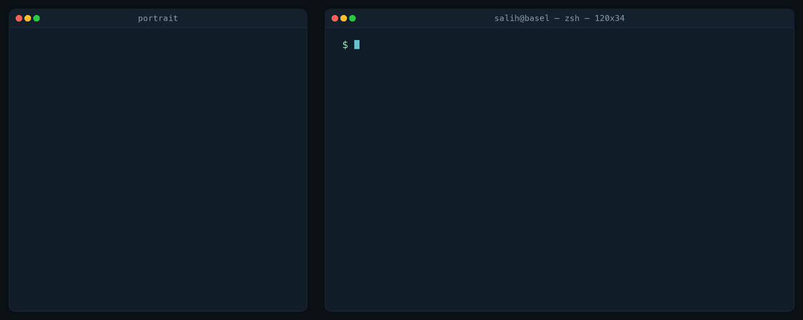

<picture>
  <source media="(prefers-reduced-motion: reduce)" srcset="assets/generated/hero-static.png">
  <source media="(max-width: 600px)" srcset="assets/generated/hero-stack.gif">
  
</picture>

## Focus

Production backend services in **Go** — goroutines, channels, Protobuf, Redis — and the
debugging discipline that keeps them running.

End-to-end **ML pipelines** where the evaluation is the hard part: leakage-safe feature
design, walk-forward validation, and reporting the result you actually got.

**Agentic systems** and spatial interfaces — multi-agent orchestration, config-driven model
routing, and making non-trivial systems legible to the people who have to use them.

## Selected work

**[FinanceIQ](https://github.com/Salih04/capstone-financeIQ)** · `Python` `FastAPI` `PostgreSQL` `Docker`
T+1 equity research signal system over 81 BIST companies. 40+ leakage-safe features,
walk-forward validation, and a research terminal whose LLM agent queries only validated
structured data.

**[Applied RL — Highway](https://github.com/Salih04/Applied-Reinforcement-Learning-Highway)** · `Python`
Reinforcement learning agents trained on highway driving scenarios.

**[CLI Task Queue](https://github.com/Salih04/CLI-Task-Queue-with-Priority-Rules)** · `Go`
Priority-rule task queue built on Go concurrency primitives.

**[Face Mask Detection](https://github.com/Salih04/Face_Mask_Detection_YOLOV8)** · `Python` `OpenCV`
Real-time detection with YOLOv8.

## Elsewhere

[Portfolio](https://salih04.github.io) · [LinkedIn](https://linkedin.com/in/salih-camci)

Istanbul → Basel, September 2026 · English (C1) · Turkish (native) · German (A1)
