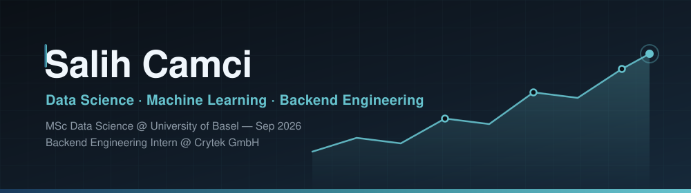

---

## About

Software Engineering graduate building **end-to-end ML pipelines**, large-scale SQL data
systems, and production backend services. Currently writing distributed Go services at
**Crytek**, and starting an **MSc in Data Science at the University of Basel** in September 2026.

- Backend Engineering Intern at **Crytek GmbH** — Go, Redis, REST, concurrent workflows
- Previously **PKF Teknoloji** (MSSQL schema and index design, −15% query time) and **BizMED** (Oracle PL/SQL tuning, −20% response time)
- Interested in applied research, honest evaluation, and data problems that survive contact with production
- Istanbul → Basel, September 2026 · learning German toward B1

---

## Tech Stack

**Languages** 

**Machine Learning & Data** 

**Backend & Infrastructure** 

**Databases** 

---

## Featured Projects

**[FinanceIQ](https://github.com/Salih04/capstone-financeIQ)** — `Python` `FastAPI` `PostgreSQL` `Docker` 
Equity research signal system over 81 BIST companies: 40+ leakage-safe features, walk-forward
cross-validation, and a full-stack research terminal driven by an ML + LLM agent.

**[Applied RL — Highway](https://github.com/Salih04/Applied-Reinforcement-Learning-Highway)** — `Python` 
Reinforcement learning agents trained on highway driving scenarios.

**[Face Mask Detection](https://github.com/Salih04/Face_Mask_Detection_YOLOV8)** — `Python` `OpenCV` 
Real-time mask detection with YOLOv8.

**[CLI Task Queue](https://github.com/Salih04/CLI-Task-Queue-with-Priority-Rules)** — `Go` 
Priority-rule task queue built on Go concurrency primitives.

**[Movie Recommender](https://github.com/Salih04/Movie_Recommendation_System)** — `C++` 
Recommendation engine implemented from scratch.

---

**Open to Data Science internships in Basel** · available from September 2026

English (fluent) · Turkish (native) · German (working toward B1)

